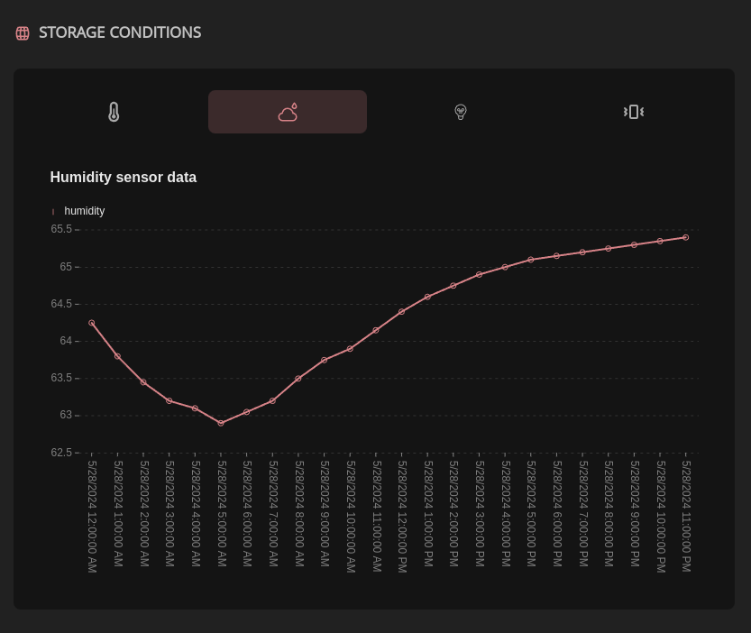

# IoT Storage

## Introduction

The IoT (Internet of Things) storage feature in our wine supply chain tracking web app enables real-time monitoring and recording of various environmental parameters that affect wine quality during storage. This feature leverages sensor data and integrates it with blockchain technology to ensure data integrity and transparency throughout the supply chain.

## Key Components

### IoT Sensors

IoT sensors are deployed to each wine storage space to monitor environmental conditions. These sensors can measure parameters such as:

- **Temperature**: Ensuring wine is stored at optimal temperatures.
- **Humidity**: Monitoring humidity levels to prevent spoilage.
- **Light Exposure**: Tracking exposure to light, which can affect wine quality.
- **Vibration**: Detecting vibrations that could affect the wine quality.

### Data Collection

Sensors continuously collect data and transmit it to a central system which then triggers an update of the data on the runing hydra head. The transmission can be done using various communication protocols such as Wi-Fi, Bluetooth, Zigbee, or cellular networks, depending on the sensor and deployment environment.

## Workflow

### Sensor Deployment

- **Placement**: Sensors are strategically placed in storage facilities, transportation vehicles, and any other relevant points in the supply chain.
- **Calibration**: Sensors are calibrated to ensure accurate readings.

### Data Transmission

- **Real-Time Monitoring**: Sensors transmit data in real-time to a central gateway or server which then triggers an update of the blockchain data.
- **Edge Computing**: In some cases, data is processed locally on the device (edge computing) before transmission to reduce latency and bandwidth usage.

### Data Integration

- **Centralized Database**: Sensor data is stored in a centralized database for easy access and analysis. A NoSQL document based database is used to efficiently handle large volumes of time-stamped data.
- **Blockchain Integration**: Data is also recorded on the Cardano blockchain using the Hydra protocol. This ensures data integrity and immutability, providing a tamper-proof record of storage conditions.

### Data Analysis and Alerts

- **Threshold-Based Alerts**: Predefined thresholds for parameters such as temperature and humidity can be set. If sensor readings exceed these thresholds, alerts are generated and sent to the winery owners via email, SMS, or push notifications.
- **Data Visualization**: The web app provides dashboards and visualization tools to monitor sensor data in real-time. Graphs and charts display trends and anomalies, allowing for proactive management.

### Data Access and Reporting

- **User Access**: Users can access the IoT data through the web app.
- **Reporting**: The system can generate detailed reports on storage conditions over specified periods. These reports can be used for compliance, quality control, and audit purposes.

## Security Considerations

- **Data Encryption**: Use encryption protocols such as TLS for data transmission and storage to ensure data security.
- **Authentication and Authorization**: Implement robust user authentication and role-based access control to protect sensitive data.
- **Blockchain Security**: Leverage the inherent security features of the Cardano blockchain to ensure data integrity and prevent tampering.

## Code Repository

More details of the implemented code and components can be found in our [**github repository**](https://github.com/blazarlabs-io/wine-app/tree/develop/src/components/widgets/SensorsGraph)
