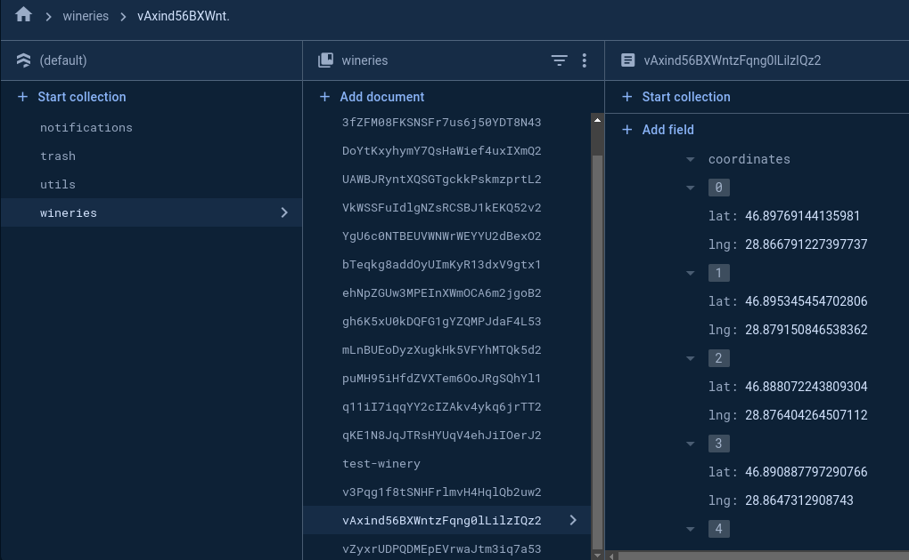

# Vineyard Mapping

This system, allows winery owners to map the area where each grape of a blend component in a wine is grown. Google Maps API is used to create this feature. More specifically a Javascript package for React JS is used [**REACT GOOGLE MAPS**](https://visgl.github.io/react-google-maps/)

## Google Maps API

The Google Maps API provides robust tools for integrating maps into web applications, including the ability to draw and manage polygons. Polygons are useful for representing areas on a map, such as vineyard boundaries in the Wine Portal Web Application. This feature allows users to create, edit, and display polygons, providing a visual representation of specific geographic areas. Polygons are multi-sided shapes on a map defined by an array of latitude and longitude coordinates. Each vertex of the polygon represents a point on the map, and the edges are drawn between consecutive points.

## Key Features


<div style="display: flex; align-items: center; justify-content: center;">
  
</div>

### Polygon Creation

- **Interactive Drawing:** Users can draw polygons interactively on the map using the drawing tools provided by the Google Maps API.
- **Manual Definition:** Polygons can also be defined programmatically by specifying an array of coordinates.

### Polygon Editing

- **Draggable Vertices:** Once a polygon is drawn, users can click and drag its vertices to reshape it.
- **Adding/Removing Vertices:** Users can add new vertices by clicking on the edges of the polygon or remove existing vertices.

### Polygon Display

- **Custom Styling:** Polygons can be styled with custom colors, opacity, and border styles.
- **Event Handling:** The API allows for event handling, such as click events on polygons, which can trigger custom actions like displaying information.

## Vanilla JS Implementation

1. **Initializing the map.** Create a new map instance and set its initial properties such as center and zoom level:

```js
const initMap = () => {
  const map = new google.maps.Map(document.getElementById("map"), {
    center: { lat: 37.7749, lng: -122.4194 },
    zoom: 10,
  });

  // Enable drawing manager
  const drawingManager = new google.maps.drawing.DrawingManager({
    drawingMode: google.maps.drawing.OverlayType.POLYGON,
    drawingControl: true,
    drawingControlOptions: {
      position: google.maps.ControlPosition.TOP_CENTER,
      drawingModes: ["polygon"],
    },
    polygonOptions: {
      fillColor: "#FF0000",
      fillOpacity: 0.5,
      strokeWeight: 2,
      clickable: true,
      editable: true,
      zIndex: 1,
    },
  });

  drawingManager.setMap(map);
};
```

2. **Handling Polygon Events.** Add event listeners to handle user interactions with polygons, such as completing a drawing or editing a polygon:

```js
google.maps.event.addListener(drawingManager, "overlaycomplete", (event) => {
  if (event.type === google.maps.drawing.OverlayType.POLYGON) {
    const polygon = event.overlay;
    polygon.setEditable(true);

    google.maps.event.addListener(polygon.getPath(), "set_at", () => {
      // Handle vertex move
      console.log("Vertex moved");
    });

    google.maps.event.addListener(polygon.getPath(), "insert_at", () => {
      // Handle vertex addition
      console.log("Vertex added");
    });

    google.maps.event.addListener(polygon.getPath(), "remove_at", () => {
      // Handle vertex removal
      console.log("Vertex removed");
    });
  }
});
```

3. **Storing Polygon Data.** To store the polygon data, retrieve the coordinates from the polygon’s path and save them in your database:

```js
const getPolygonCoordinates = (polygon) => {
  const path = polygon.getPath();
  const coordinates = [];
  for (let i = 0; i < path.getLength(); i++) {
    const latLng = path.getAt(i);
    coordinates.push({ lat: latLng.lat(), lng: latLng.lng() });
  }
  return coordinates;
};
```

4. **Loading and Displaying Saved Polygons.** To display previously saved polygons, retrieve the coordinates from the database and use them to create new polygons on the map:

```js
const loadPolygon = (coordinates) => {
  const polygon = new google.maps.Polygon({
    paths: coordinates,
    fillColor: "#FF0000",
    fillOpacity: 0.5,
    strokeWeight: 2,
    editable: true,
    map: map,
  });

  google.maps.event.addListener(polygon.getPath(), "set_at", () => {
    // Handle vertex move
    console.log("Vertex moved");
  });

  google.maps.event.addListener(polygon.getPath(), "insert_at", () => {
    // Handle vertex addition
    console.log("Vertex added");
  });

  google.maps.event.addListener(polygon.getPath(), "remove_at", () => {
    // Handle vertex removal
    console.log("Vertex removed");
  });
};
```

## Code Repository

More details of the implemented code and components can be found in our [**github repository**](https://github.com/blazarlabs-io/wine-app/tree/develop/src/components/widgets/MapComponents)
