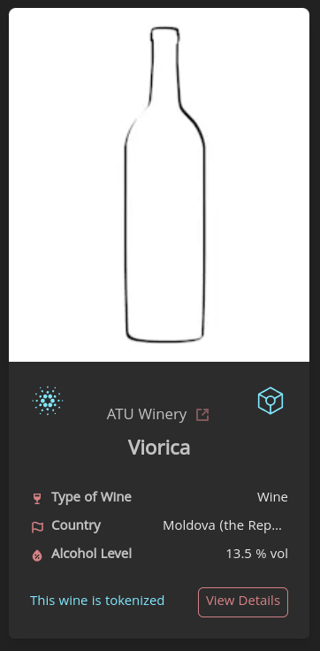

# Wine Tokenization

The Wine Tokenization Feature is an innovative solution integrated into our platform. With a simple click, users can tokenize thier registered wine onto the cardano blockchain. This feature enables supply chain tracking on a particular wine product.

## The Process

When a wine is tokenized, an IPFS is created an populated with a JSON file containing all the collected information from the wine and its winery. The result ipfs url is then posted to an endpoint on our blazarlabs API, which then runs the tokenization process starting with the mint of the asset on the carnano blockchain. All fees are payed by a single project wallet on our web app, hence removing the friction for non-blockchain users.



## Integration To Backend

The transaction building functions are written in lucid in `wine.ts`

`wine.ts` currently uses Deno, to access the npm package for lucid, you need
`lucid-cardano`

```sh
npm install lucid-cardano
```

you will also need a Blockfrost API key, you can get a free one on their website which
will be good enough for now.

insert a key for the `preview` testnet at:

```
const BLOCKFROST = <YourApiKey>
```

We need to call these functions with some data (like new IPFS) to submit the transaction
with an infrastructure wallet.

We output the txHash so we can record changes in a database.

## Infrastructure Wallet

To sign and submit transactions we wiil need an infrastructure wallet which will allow
the backend to make token updates automatically, I have a script to generate a wallet
`generate-credentials.ts` which will output a cli wallet - address and signing key -
which you can use with the transaction code ( it is currently set up for my own testnet
wallet ).

It will create an `owner.addr` and `owner.sk` file which will be needed for `wine.ts`
like so:

```
lucid.selectWalletFromPrivateKey(await Deno.readTextFile("./owner.sk"));
```

this will initialise lucid with the infrastructure wallet as the one interacting, it
will pay the fees, it will sign the transactions.

## Building

For the contracts:

```sh
aiken build
```

## Testing

To run all validator tests, simply do:

```sh
aiken check
```

## Using The Contracts

To use the contracts you will need to apply the script parameters to the validator output
of `plutus.json` when you build the contracts.

Because i have tested the offchain code by running it as a script, they are applied and
assigned to constants at the top of the file:

```ts

...

const mint = await readMintValidator()

...

async function readMintValidator(): Promise<MintingPolicy> {
  const validator = JSON.parse(await Deno.readTextFile("plutus.json")).validators[2];
  return {
    type: "PlutusV2",
    script: applyParamsToScript(applyDoubleCborEncoding(validator.compiledCode), [ownerPKH]),
  };
}

...

```

`ownerPKH` will be the pubkeyHash of the infrastructure wallet.

## Setting Data

data for transactions will need to be done dynamically but we create things in the
following manner:

```ts

...

const lAddress = lucid.utils.validatorToAddress(lock)

const lDatum = Data.to(
  new Constr(0, [
    new Constr(0, [
      fromText("Rioja"),
      fromText("image"),
      fromText("ipfsHere"), // image IPFS wink
      fromText("newTrackingData") // supply chain data IPFS link
    ])
  ]),
  new Constr(1, [BigInt(0)]) // this is the metadata version so we need to increment this every update
)

const lockHash = lucid.utils.getAddressDetails(lAddress).paymentCredential.hash

...

```

This gets the address of the `lock` validator, `lDatum` is the wine metadata held at the
utxo ( you need to construct it from this template ) and finally `lockHash` is the
validator script credential.

The redeemers further down are used to execute certain kinds of validation and so need to maintain the basic structure they are in.

`tokenName` can be a variable applied to each NFT, no duplicates.
to update the tracking data use `updateRedeemer` with the `newTrackingData` as an IPFS
link.

## Transaction Code

at the bottom of `wine.ts` we have the final transaction calls for each operation of the
smart contracts.

Each of these will need to be separate functions applied when needed to mint new wine
assets, burn exuisting ones, update the tracking data and purchasing the wine.

When you are using these in the backend they will often have to process the incoming data
or lookup information on the blockchain so that will have to be gathered at the function
call as things can change quite quickly, of course.

## The Validators

This collection of contracts have 3 validators,

Token Minting Policy - Mints or burns assets

Reference Token Locking Validator - stores the refToken with its associated Datum

Distribution Validator - holds the fractionalised user assets representing a bottle of
wine for each token

The helper functions allow us to minimise the code of repeat tasks and the tests verify
the functionality of the code.

We also have some test tools in `lib` for creating dummy data and types.

## Code Repository

More details of the implemented code and components can be found in our [**github repository**](https://github.com/blazarlabs-io/wine-contracts)
